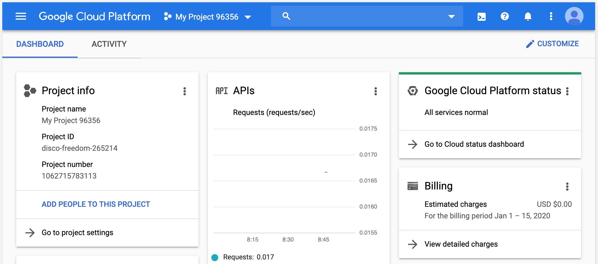
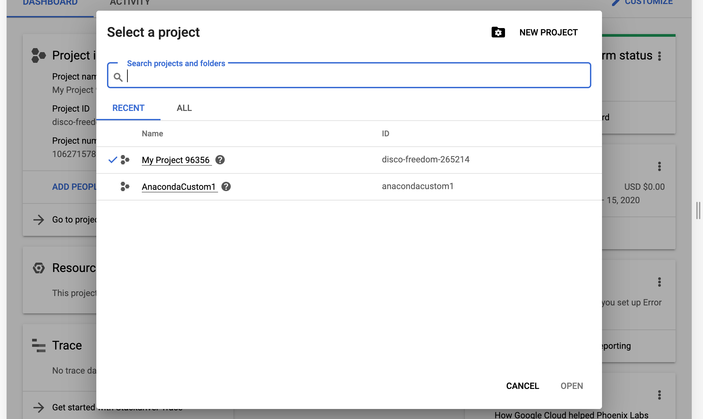
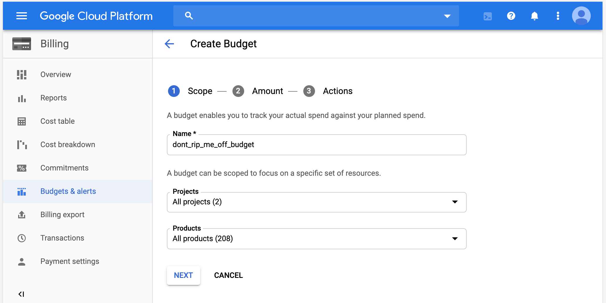
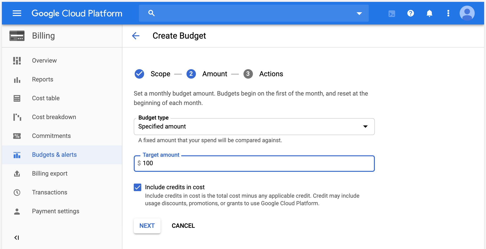
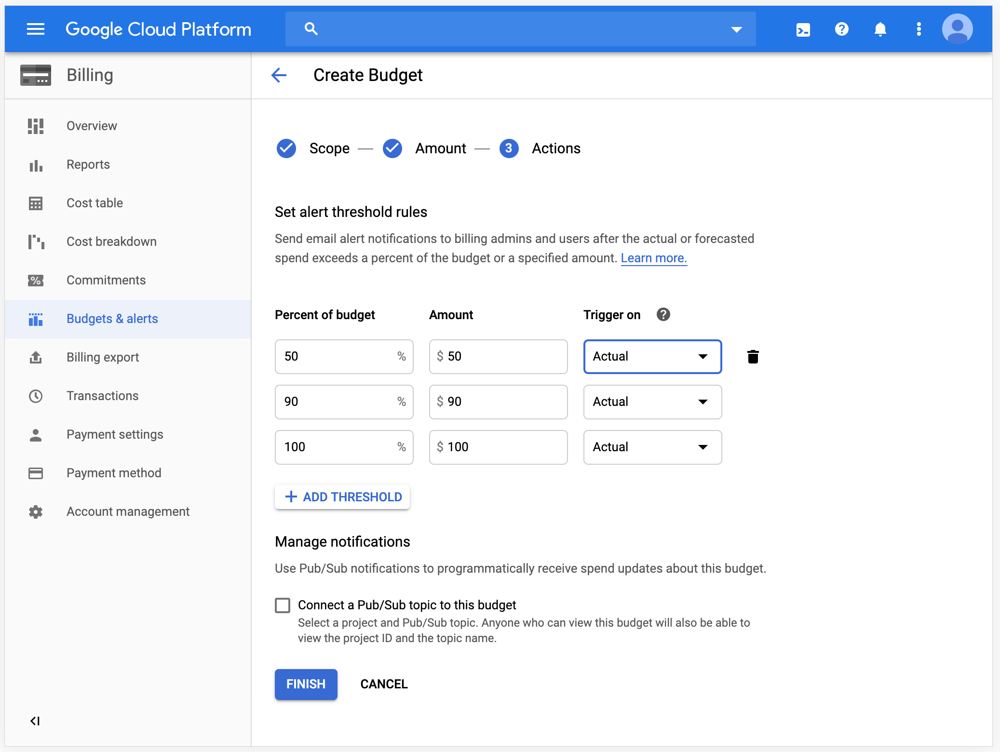
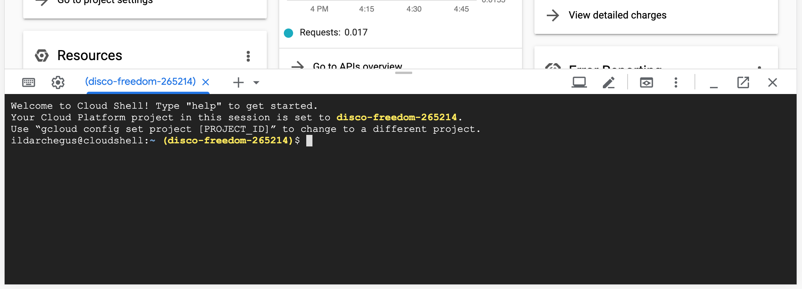

# Speed up your research

### Intro

Какой бы быстрый ноутбук или десктоп у вас не был, всегда найдется датасет, для которого построение модели может занять часы или дни. Что делать, если хочется попробовать вашу модель на более мощном компьютере? Вы можете арендовать виртуальную машину в облаке.

В этой краткой инструкции я расскажу, как запустить Jupyter Notebook на мощном виртуальной машине за довольно скромные деньги.

Инструкция будет разбита на две части `Setup` и `Run`. В первой части мы подготовим параметры окружения, запустим первую виртуальную машину, при помощи скрипта установим на нее все необходимые программы (Jupyter Notebook, Python libraries etc.), скопируем образ с этой виртуальной машины, чтобы в дальнейшем использовать этот образ для быстрого старта. Этот этап мы выполним один раз. Во второй части `Run` мы подготовим скрип, который вы будете в дальнейшем использовать для каждого запуска Jupyter Notebook.


### GCP

Google Cloud Platform  (Гугл Клауд Платформ) или GCP (ДжиСиПи) один из облачных гигантов (наравне с Amazon Web Services и Microsoft Azure). Для новых клиентов Гугл дает кредит 300 долларов на год, которые можно потратить на различные облачные сервисы, в том числе на виртуальные машины. Для регистрации вам придется указать данные кредитной карты. Деньги с нее списывать не должны, даже если вы потратите бонусные кредиты. Списание с карты начнется только после того, как вы решите апгрейдить аккаунт и израсходуете все бонусные кредиты. На начальном этапе, так как у условно бесплатный аккаунт и вы тратите бонусные деньги, у вас будут ограниченные возможности (вы не сможете создать 20 виртуальных машин по 32 CPU каждая). Однако на первом этапе минимум 1 виртуальную машину с 8 CPU и 16GB вы создать сможете.

https://cloud.google.com/gcp/


### SETUP 

После того, как вы создали учетную запись, у вас автоматически создается Project (Проект). Инфраструктура гугловского облака устроена так, что все создается в рамках какого-либо проекта. И, например если удалить проект - будут удалены все ресурсы (виртуальные машины, диски, базы данных), которые были связаны с этим проектом. Биллинг (выставление счетов за использование ресурсов) также происходит в рамках одного проекта.

Когда вы зайдете в вашу GCP Console https://console.cloud.google.com/, вы увидите ваш текущий проект вида `My Project 96356` в правом верхнем углу, а также виджет Project Info с более детальной информацией, где можно посмотреть Project ID или Идентификатор проекта (он вам понадобится в дальнейшем).



 Если кликнуть на название проекта в верхнем правом углу, то откроется окно со списком проектов (для переключения между ними), где также можно найти Project ID.



Первое что необходимо сделать, это настроить уведомления о расходовании денег. Несмотря на то, что у вас на счету 300 бонусных долларов, после того как они закончатся, деньги начнут списываться с вашей кредитной карты. Чтобы избежать незапланированных расходов, необходимо создать бюджеты (https://cloud.google.com/billing/docs/how-to/budgets). Три следующих скриншота покажут как это сделать.








Несмотря на то, что практически все операции в GCP можно делать через веб-интерфейс, в этой статье мы будем все делать через командную строку при помощи Cloud Shell (Клауд Шел). Это бесплатная виртуальная машина, которая позволяет управлять всем через командную строку GCP Console. Для ее активации необходимо нажать иконку Cloud Shell (правый верхний угол, левее иконки `?`).



Для начала поместим в переменную окружения Project ID (вы должны подставить свой) и другие дополнительные переменные:

```bash
export PROJECT=disco-freedom-265214
export REGION=us-east1
export ZONE=us-east1-b
export FUTURE=instance-for-future-image
export IMAGE=anacondaimage
export IPNAME=anacondajupyterip
export NAME=anacondajupyter
```

Гугл предоставляет кучу сервисов, но большая часть их них поумолчанию неактивна. Нам необходимо будет активировать сервис Compute, который, собственно, и отвечает за работу виртуальных машин. Сделаем это при помощи следующий команды (активация может занять пару минут):
```bash
gcloud services enable compute.googleapis.com --project=$PROJECT
```

После активации сервиса получим email служебной учетной записи для `Compute Engine default service account` при помощи команды:
```bash
gcloud iam service-accounts list --project=$PROJECT
```

Email вида `1062715783113-compute@developer.gserviceaccount.com` необходимо будет поместить в переменную окружения`CE_SERV_ACC`.
```bash
export CE_SERV_ACC=$(gcloud iam service-accounts list --format="value(email)" --filter="NAME='Compute Engine default service account'" --project=$PROJECT)
```

Далее создадим правило для файрвола, чтобы мы в дальнейшем могли подключаться к Jupyter Notebook на порт 8888:
```bash
gcloud compute \
	--project=$PROJECT firewall-rules create anacondajupyterrule \
	--direction=INGRESS \
	--priority=1000 \
	--network=default \
	--action=ALLOW \
	--rules=tcp:8888 \
	--source-ranges=0.0.0.0/0 \
	--target-tags=anacondajupytertag
```

Создадим скрипт, который будет запущен при первом старте виртуальной машины и который установит все необходимые программы (если вам нужны дополнительные библиотеки - просто добавьте строчки `pip install ВашаБиблиотека`):
```bash
echo '#! /bin/bash
logger "vmtest01"
sudo apt-get update -y
sudo apt-get install libgl1-mesa-glx libegl1-mesa libxrandr2 libxrandr2 libxss1 libxcursor1 libxcomposite1 libasound2 libxi6 libxtst6 -y
logger "vmtest02"
su anaconda
cd ~/
logger "vmtest03"
curl https://repo.anaconda.com/archive/Anaconda3-2019.10-Linux-x86_64.sh > anaconda3.sh
logger "vmtest04"
sudo bash anaconda3.sh -b -p /opt/anaconda3
sudo chown -R anaconda:anaconda /opt/anaconda3
sudo rm anaconda3.sh
logger "vmtest05"
eval "$(/opt/anaconda3/bin/conda shell.bash hook)"
logger "vmtest06"
conda init
logger "vmtest07"
source ~/.bashrc
logger "vmtest08"
conda install pip -y
logger "vmtest09"
pip install pandas
pip install matplotlib
pip install seaborn
pip install sklearn
pip install tensorflow
pip install keras
pip install h2o
pip install scikit-optimize
logger "vmtest99"' > startup.sh
```

Создадим виртуальную машину, которая будет использоваться для создания образа:
```bash
gcloud compute \
	--project=$PROJECT instances create $FUTURE \
	--zone=$ZONE \
	--machine-type=n1-standard-2 \
	--subnet=default \
	--network-tier=PREMIUM \
	--maintenance-policy=MIGRATE \
	--service-account=$CE_SERV_ACC \
	--scopes=https://www.googleapis.com/auth/cloud-platform \
	--image=ubuntu-1804-bionic-v20200108 \
	--image-project=ubuntu-os-cloud \
	--boot-disk-size=200GB \
	--boot-disk-type=pd-standard \
	--boot-disk-device-name=instance-1 \
	--reservation-affinity=any \
	--metadata-from-file startup-script=startup.sh \
	--tags=anacondajupytertag
```

Запомним внешний IP Address, который получила созданная виртуальная машина:
```bash
gcloud compute instances describe instance-for-future-image --project=$PROJECT --zone=us-east1-b | grep natIP
```

Подключимся к вновь созданной виртуальной машине. Если получили ошибку подключения, попробуем еще раз через 1 мин:
```bash
gcloud compute ssh anaconda@$FUTURE --project=$PROJECT --zone=$ZONE
```

Убедимся, что мы находимся внутри только что созданного виртуального сервера. Командная строка должна выглядеть следующим образом:
```bash
anaconda@instance-for-future-image:~$
```

Проверим статус работы скрипта, который отвечал установку приложений (должно вывести на экран от 0 до 10 строк с текстом vmtestXX):
```bash
grep vmtest /var/log/syslog
```

Мы должны увидеть следующие записи. Если записи не все или нет вообще, команду приведенную выше необходимо повторить через 1 мин.
```bash
anaconda@instance-for-future-image:~$ grep vmtest /var/log/syslog
Jan 16 03:05:00 instance-for-future-image root: vmtest01
Jan 16 03:05:18 instance-for-future-image root: vmtest02
Jan 16 03:05:18 instance-for-future-image root: vmtest03
Jan 16 03:05:21 instance-for-future-image root: vmtest04
Jan 16 03:06:11 instance-for-future-image root: vmtest05
Jan 16 03:06:12 instance-for-future-image root: vmtest06
Jan 16 03:06:12 instance-for-future-image root: vmtest07
Jan 16 03:06:12 instance-for-future-image root: vmtest08
Jan 16 03:06:21 instance-for-future-image root: vmtest09
Jan 16 03:07:31 instance-for-future-image root: vmtest99
anaconda@instance-for-future-image:~$
```

Инициализируем настройки Anaconda и Jupyter Notebook (вас попросят ввести пароль, с которым в дальнейшем будете подключаться к ноутбуку):
```bash
eval "$(/opt/anaconda3/bin/conda shell.bash hook)"
conda init
source ~/.bashrc
jupyter notebook --generate-config
jupyter notebook password
```

Запускаем ноутбук:
```bash
jupyter notebook --ip 0.0.0.0 --port 8888 --no-browser
```

Открываем браузер по адресу, который мы получили выше http://35.190.129.11:8888/ и убеждаемся, что ноутбук работает.

Командой `CTRL+C` останавливаем ноутбук и отключаемся от виртуальной машины:
```bash
exit
```

Убедимся, что мы отключились от виртуальной машины и сейчас снова находимся в Cloud Shell:
```bash
ildarchegus@cloudshell:~ (disco-freedom-265214)$
```

Повторно поместим все переменные в окружение:
```bash
export PROJECT=disco-freedom-265214
export REGION=us-east1
export ZONE=us-east1-b
export FUTURE=instance-for-future-image
export IMAGE=anacondaimage
export IPNAME=anacondajupyterip
export NAME=anacondajupyter
```

Остановим виртуальную машину для будущего создания образа:
```bash
gcloud beta compute \
	--project=$PROJECT instances stop $FUTURE \
	--zone=$ZONE
```

Создадим образ виртуальной машины (займет несколько минут):
```bash
gcloud compute images create $IMAGE \
	--project=$PROJECT \
	--source-disk=$FUTURE \
	--source-disk-zone=$ZONE \
	--storage-location=$REGION
```

Удалим виртуальную машину, которую использовали для создания образа (займет несколько минут):
```bash
gcloud beta compute \
	--project=$PROJECT instances delete $FUTURE \
	--zone=$ZONE
```

Зарезервируем Static IP, на котором в дальнейшем будет доступен наш ноутбук:
```bash
gcloud compute addresses create $IPNAME --project=$PROJECT --region=$REGION
```

### RUN

Поместим все переменные в окружение:
```bash
export PROJECT=disco-freedom-265214
export REGION=us-east1
export ZONE=us-east1-b
export FUTURE=instance-for-future-image
export IMAGE=anacondaimage
export IPNAME=anacondajupyterip
export NAME=anacondajupyter
export CE_SERV_ACC=$(gcloud iam service-accounts list --format="value(
email)" --filter="NAME='Compute Engine default service account'" --project=$PROJECT)
export IPADDRESS=$(gcloud compute addresses list --format="value(
'ADDRESS/RANGE')" --filter="NAME='anacondajupyterip'" --project=$PROJECT)
```

Создадим виртуальную машину для работы с ноутбуком:
```bash
gcloud compute --project=$PROJECT instances create $NAME \
	--zone=$ZONE \
	--address=$IPADDRESS \
	--machine-type=e2-highcpu-8 \
	--subnet=default \
	--no-restart-on-failure \
	--maintenance-policy=TERMINATE \
	--preemptible \
	--service-account=$CE_SERV_ACC \
	--scopes=https://www.googleapis.com/auth/cloud-platform \
	--tags=anacondajupytertag \
	--image=$IMAGE \
	--image-project=$PROJECT \
	--boot-disk-size=200GB \
	--boot-disk-type=pd-standard \
	--boot-disk-device-name=$NAME \
	--reservation-affinity=any
```

Подключимся к виртуальной машине:
```bash
gcloud compute ssh anaconda@$NAME --project=$PROJECT --zone=$ZONE
```

Запустим Jupyter Notebook:
```bash
jupyter notebook --ip 0.0.0.0 --port 8888 --no-browser
```

### DELETE

Командой `CTRL+C` останавливаем ноутбук и отключаемся от виртуальной машины:
```bash
exit
```

Командой `CTRL+C` останавливаем ноутбук и удаляем виртуальную машину:
```bash
gcloud compute --project=$PROJECT instances delete $NAME --zone=$ZONE
```

### WHAT DO YOU PAY FOR

Вы платите за используемые ресурсы. Для создания образа мы временно создали виртуальную машину типа `--machine-type=n1-standard-2`, которая стоит `$0.0950 / hourly` (посекундная тарификация после первой минуты) с диском в `200GB`, который стоит `$0.040 per GB / month`. Несложная калькуляция покажет, что эта разовая операция обошлась нам в несколько центов. 

Хранение образа, который мы создали для быстрого и стабильного запуска виртуальной машины будет стоит `$0.085 per GB / month`.

Непосредственно машина, которую мы планируем использовать на постоянной основе имеет тип `--machine-type=e2-highcpu-8` (8 CPU, 8GB) и в режиме `--preemptible` стоит `$0.05936 / hourly` плюс `$0.040 per GB / month` за `200GB`. Итого можно рассчитывать на 7-8 американский центов в час. ВАЖНОЕ ЗАМЕЧАНИЕ. Виртуальная машина запускается в режиме `--preemptible`. Это означает, что ваш виртуальный сервер не может работать дольше 24 часов и что Гугл может удалить его в любой момент (с полной потерей всех ваших данных). Именно из-за этих условий вы получаете большую скидку. Обычная стоимость такого сервера `$0.19788 / hourly`. Планируйте вашу работу соответственно и используйте сервер только для экспериментов. Несмотря на то, что теоретически `--preemptible` удаляется через 24 часа, я рекомендую после использовал всегда удалять сервера вручную. Особенно внимательно нужно к этому относиться, если вы запустили мощную машину без параметра `--preemptible`. 

Типы виртуальных машин можно посмотреть [здесь](https://cloud.google.com/compute/docs/machine-types), цены на виртуальные машины [здесь](https://cloud.google.com/compute/vm-instance-pricing), цены на диски [здесь](https://cloud.google.com/compute/disks-image-pricing).

На стоимость ресурсов также влияет регион и зона, в которой они находятся. В нашем случае мы использовали REGION=us-east1 и ZONE=us-east1-b. Их список можно найти [здесь](https://cloud.google.com/compute/docs/regions-zones/). 

Выбранные регион и зона влияют на доступность определенных ресурсов. Например, `C2 machine types` доступны только в опреленных зонах региона `Europa`. 


